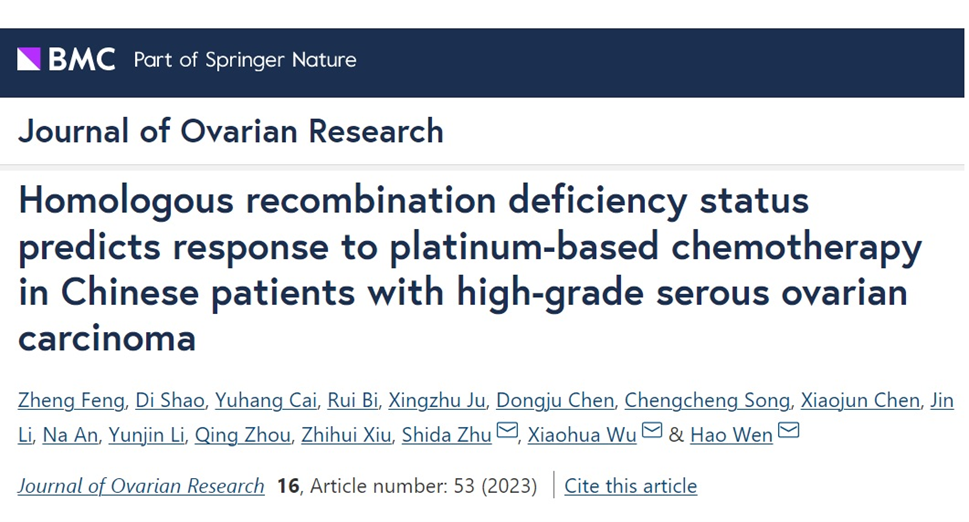
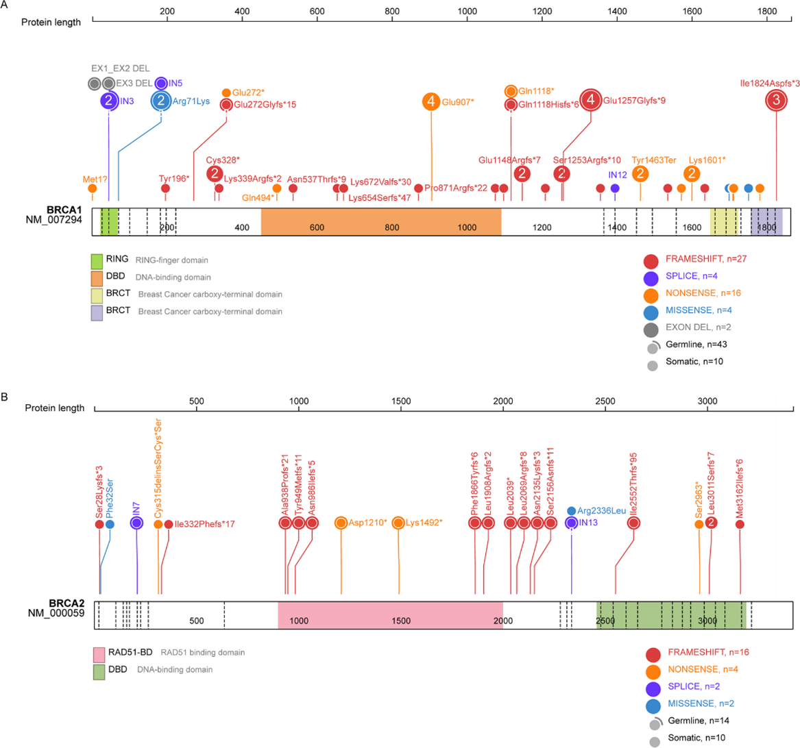
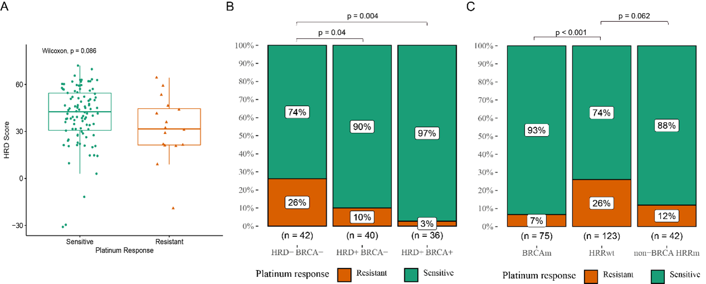
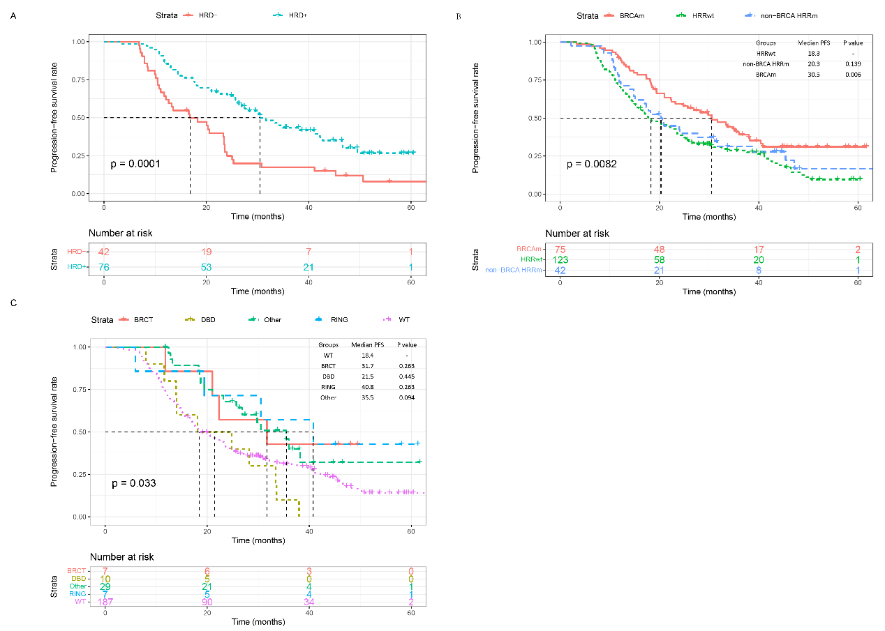

---

**Background**
Homologous Recombination Deficiency (HRD) is a predictive biomarker for ovarian cancer treated with PARP inhibitors or for breast cancer treated with first-line platinum-based chemotherapy. However, limited research is documented on platinum-based treatment prediction with HRD as a biomarker in ovarian cancer patients, especially in the Chinese population. 

**Methods**  
We investigated the association between HRD status and the response of platinum-based chemotherapy in 240 Chinese HGSOC patients. 

**Results** 
The Pt-sensitive patients showed higher HRD scores than Pt-resistant ones, but this was not significant(median: 42.6 vs. 31.6, p = 0.086). (Pt)-sensitive rate was higher in HRD + BRCA m tumors and in HRD + BRCA wt tumors (HRD + BRCA m: 97%, p = 0.004 and HRD + BRCA wt: 90%, p = 0.04) compared with 74% in the HRD-BRCA wt tumors. We also found Pt-sensitive patients tend to be enriched in patients with BRCA mutations or non-BRCA HRR pathway gene mutations (BRCA : 93.6% vs 75.4%, p < 0.001; non-BRCA HRR: 88.6% vs 75.4%, p = 0.062). Patients with HRD status positive had significantly improved PFS compared with those with HRD status negative (median PFS: 30.5 months vs. 16.8 months, Log-rank p = 0.001). Even for BRCAwt patients, positive HRD was also associated with better PFS than the HRD-negative group (median: 27.5 months vs 16.8 months, Log-rank p = 0.010). Further, we found patients with pathogenic mutations located in the DNA-binding domain (DBD) of BRCA1 had improved FPS, compared to those with mutations in other domains. (p = 0.03). 

**Conclusions**
The HRD status can be identified as an independent significance in Chinese HGSOC patients treated with first-line platinum-based chemotherapy.

