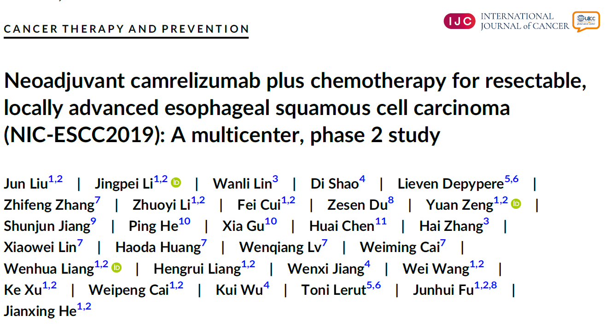
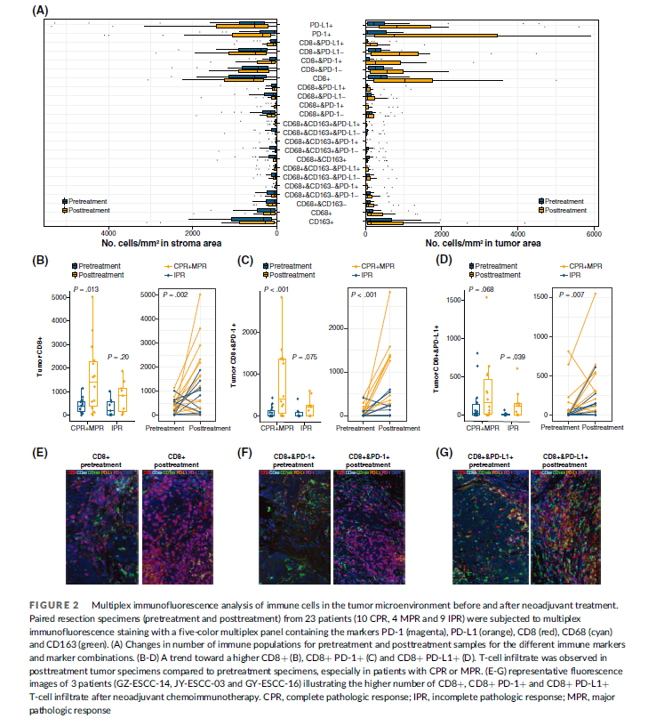

**BACKGROUND**
Optimal treatment for resectable esophageal squamous cell carcinoma (ESCC) is controversial, especially in the context of potential benefit of combining PD-1 blockade with neoadjuvant therapy. 

**METHODS**
This phase 2 study aimed to assess neoadjuvant camrelizumab plus chemotherapy in this population. Patients (clinical stage II-IVA) received two cycles of neoadjuvant chemoimmunotherapy (NIC) with camrelizumab (200 mg on day 1) plus nab-paclitaxel (260 mg/m2 in total on day 1 and day 8) and cisplatin (75 mg/m2 in total on days 1-3) of each 21-day cycle. Surgery was performed approximately 6 weeks after completion of NIC. Primary endpoint was complete pathologic response (CPR) rate in primary tumor. Secondary endpoints were objective response rate (ORR) per RECIST v1.1, 2-year progression-free survival (PFS) rate after surgery, PFS, overall survival (OS) and safety during NIC and perioperative period. 

**RESULTS**
Between 17 January 2020 and 8 December 2020, 56 patients were enrolled, and 51 received esophagectomy. Data cutoff date was 25 August 2021. The CPR rate was 35.3% (95% CI, 21.7%-48.9%). NIC had an ORR of 66.7% (95% CI, 40.0%-70.4%) and treatment-related adverse events (TRAEs) of low severity (grade 1-2, 75.0%; grade 3, 10.7%; grade 4-5, no). No perioperative mortality occurred. Three (5.9%) patients had tumor recurrence and one (2.0%) patient died. The 2-year PFS rate, median PFS and median OS had not been reached yet. 

**CONCLUSIONS**
Camrelizumab plus neoadjuvant chemotherapy in resectable ESCC demonstrates promising efficacy with acceptable toxicity, providing a feasible and effective option. Study is ongoing for long-term survival analyses.

