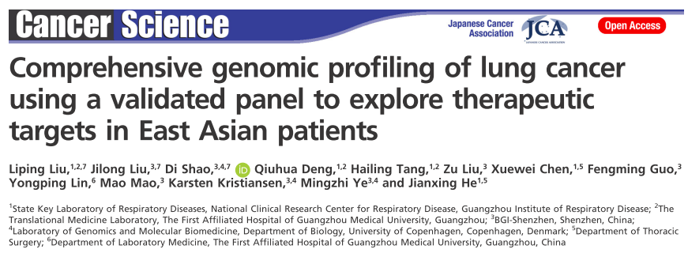
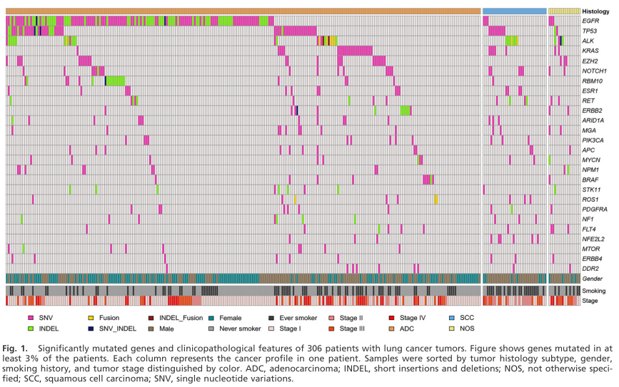
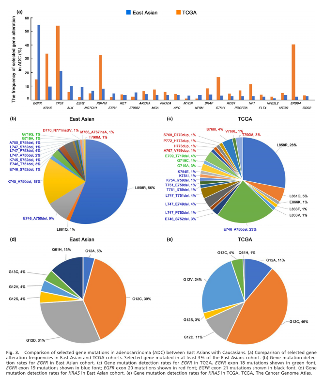

---

**Background**

People of East Asian ethnicity have a different prevalence of and show unique clinical characteristics and tumor histology of oncogenic mutations. However,only limited studies have explored the landscape of genomic alterations in lung adenocarcinoma derived from Asian patients thus far. 

**Methods**

In this single-center study,with an aim to elucidate the mutational profile of lung cancer in people of Chinese ethnicity and to use the obtained information to guide decision-making for treatment, we employed a well-validated assay to perform comprehensive genomic characterization of tumor specimens from 306 Chinese lung cancer patients.

**Results**

A total of 845 individual genomic alterations were found in 145 tumor-related genes with a median of 2.8 alterations (range: 1–18) per sample. The most frequently mutated genes were EGFR (46.7%), TP53 (21.2%), ALK (12.1%; 8.8% of mutation and 3.3% of rearrangement) and KRAS (10.1%). Upon comparison with the Cancer Genome Atlas dataset, we found that EGFR was mutated at a much higher frequency in our cohort than in Caucasians, whereas KRAS was only found in 10.1% of our Chinese patients. Clinically relevant genomic alterations were identified in 185 (60.5%) patients, including 50% in adenocarcinoma patients and 14% in squamous cell carcinoma patients. 

**Conclusion**

Our findings suggest that the Asian ethnicity is signficantly different from the Caucasian ethnicity with regard to thepresence of somatic driver mutations. Furthermore, we showed that the use of a comprehensive genotyping approach could help identify actionable genomic alterations that have potential impact on therapeutic decisions.

