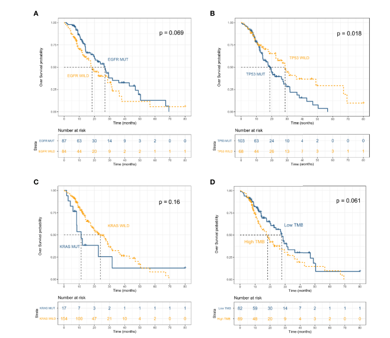
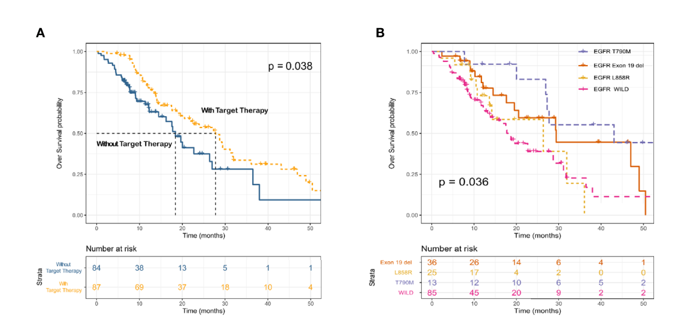

---

### 01研究设计

本研究为单中心、回顾性队列研究。自2016年1月至2019年10月共纳入233例NSCLC患者。利用688 panel对肿瘤组织样本进行基于目标区域捕获测序的突变谱检测。其中171例临床病理和随访资料完整的患者纳入生存分析。

### 02研究结果

**驱动突变的基因分布**

驱动突变的频率与其他研究相似。最高频突变为EGFR（51％），其次是KRAS（9％），PIK3CA（7％），ALK（7％），MET（6％）和BRAF（5％）（图1）。ALK融合，HER2插入，MEK突变，KIF5B-RET和CD74-ROS1融合与其他驱动突变互斥。TMB high在年轻女性和吸烟患者中更为常见。 TP53，EGFR，BRAF，ROSI和RET突变与TMB状态显著相关。

图1：233例NSCLC患者基因组和临床病理特征

**EGFR突变不同亚型TKI治疗预后差异明显**

携带KRAS和TP53突变的患者的OS较短（mOS：11.3 vs 24.0个月， P = 0.16和mOS：18.7 vs 28.7个月，P = 0.018）（图2）；可靶向治疗（EGFR和ALK TKIs）的患者的OS较其他患者更长，另外发现携带EFGR各个突变亚型的患者接受TKI治疗的效果并不相同 （图 3）。免疫相关生物标志物方面， TMB-low和较长的OS相关（mOS：18.4 vs 27.7个月； P = 0.061）； MSI-low和MSS两组间的OS没有显著差异。

图2：以EFGR,TP53和KRAS突变状态以及TMB分层的患者的总体生存曲线

图3：根据是否接受靶向治疗和EGFR突变亚型分层的总生存曲线

**EGFR共突变影响EGFR TKI治疗效果**

共检测到86例EGFR突变的肿瘤，其中最常见的共突变为TP53突变（64%）和PIK3CA突变 （7.0%）。 单因素分析和多因素Cox比例风险模型都发现TP53共突变与较短的OS相关；PIK3CA突变也与OS有关，但差异并不显著（P = 0.08）（图4）。

图4：EGFR共突变对EGFR-TKIs治疗效果的影响

### 03小结

本项研究全面分析了中国人群非小细胞肺癌的驱动突变和基因组特征，评估了上述特征对于预测疾病预后和指导个体化治疗的作用，并在真实世界中证实了基于基因组全景图谱的精准治疗对提高非小细胞肺癌总生存的临床意义。

[全文链接](https://www.frontiersin.org/articles/10.3389/fonc.2021.630717/full)

