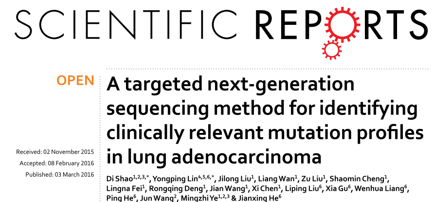
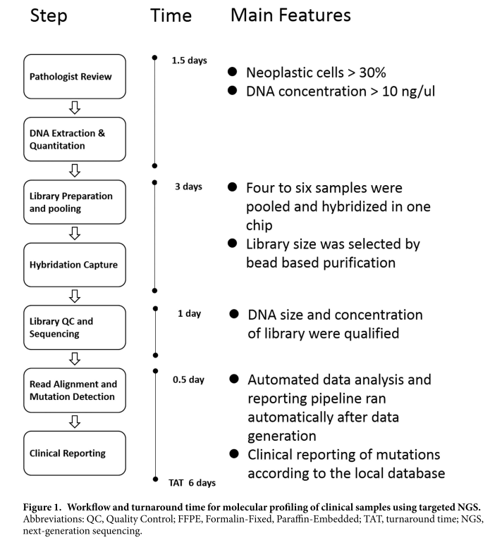
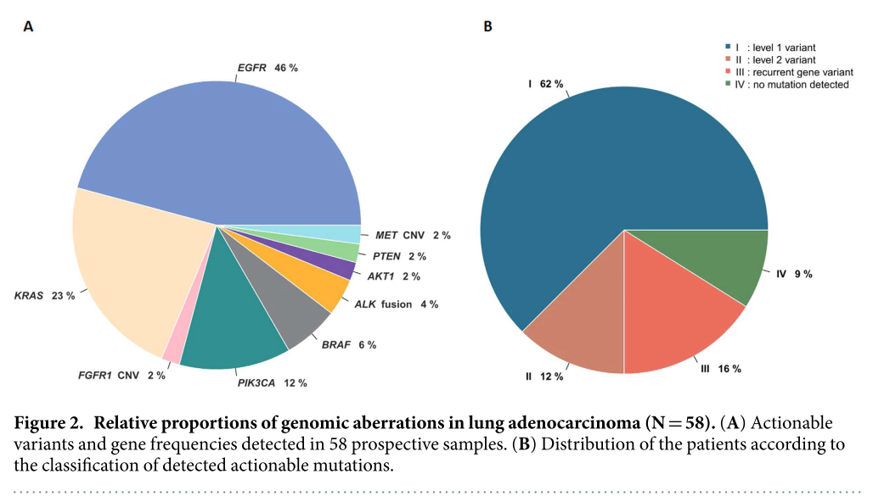

---

**Backgroud**

Molecular profiling of lung cancer has become essential for prediction of an individual’s response to targeted therapies. Next-generation sequencing (NGS) is a promising technique for routine diagnostics, but has not been sufficiently evaluated in terms of feasibility, reliability, cost and capacity with routine diagnostic formalin-fixed, paraffin-embedded (FFPE) materials. 

**Methods**

Here, we report the validation and application of a test based on Ion Proton technology for the rapid characterisation of single nucleotide variations (SNVs), short insertions and deletions (InDels), copy number variations (CNVs), and gene rearrangements in 145 genes with FFPE clinical specimens.

**Results**

The validation study, using 61 previously profiled clinical tumour samples, showed a concordance rate of 100% between results obtained by NGS and conventional test platforms. Analysis of tumour cell lines indicated reliable mutation detection in samples with 5% tumour content. Furthermore, application of the panel to 58 clinical cases, identified at least one actionable mutation in 43 cases, 1.4 times the number of actionable alterations detected by current diagnostic tests. 

**Conclusion**

We demonstrated that targeted NGS is a cost-effective and rapid platform to detect multiple mutations simultaneously in various genes with high reproducibility and sensitivity.

