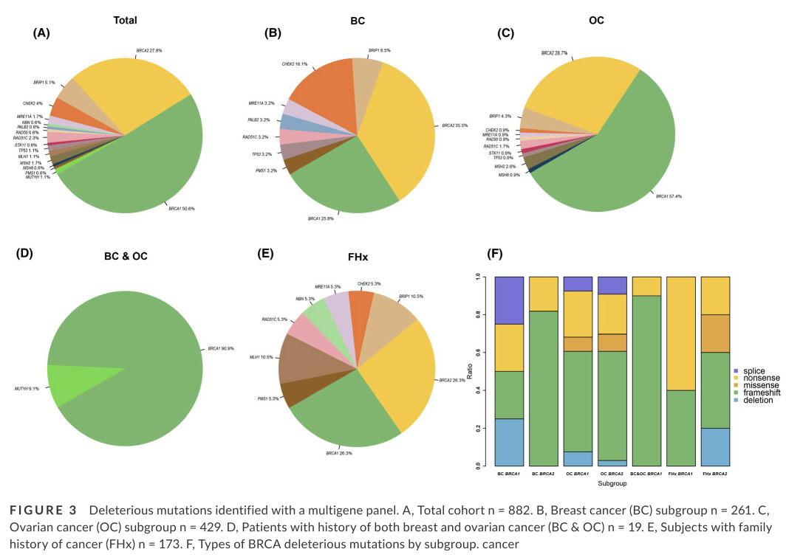
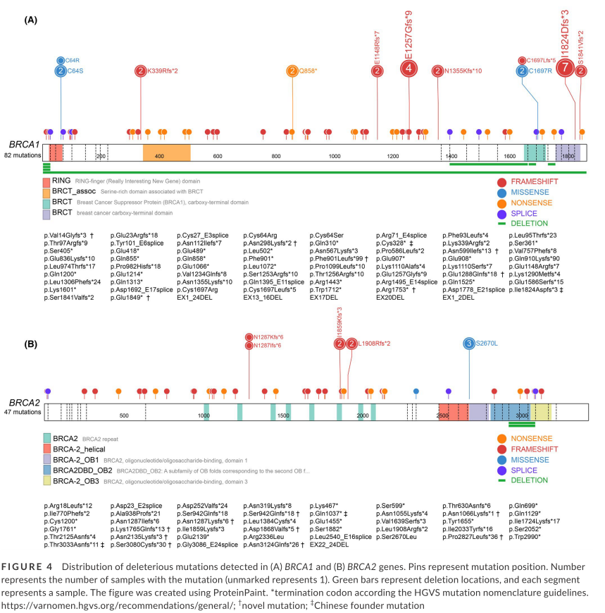

Abstract 
### background
Identification of deleterious variants in hereditary breast and ovarian cancer (HBOC) susceptibility genes allows for increased clinical surveillance and early detection, and could predict the response to poly (ADP-ribose) polymerase (PARP) inhibitor in patients with  advanced ovarian carcinomas. 
### methods
To determine the prevalence and clinical prediction fac- tors for HBOC syndrome, 882 selected individuals underwent multigene panel testing for  HBOC risk assessment during the period from January 2015 to March 2018. 
### results
Overall, 176  deleterious mutations were observed in 19.50% (n = 172) of individuals. Twenty-six of 176  mutations could not be retrieved in related public databases and were considered to be  novel. Among patients with ovarian cancer, 115 deleterious mutations were identified in  429 patients (48.6%) with significant enrichment for a family history of breast or ovarian  cancer syndrome (P < .05). In the breast cancer subgroup, 31 deleterious mutations were  identified in 261 patients. Besides BRCA1 (8; 25.8%) and BRCA2 (11; 35.5%), the most  frequently occurring genes, an additional 12 deleterious mutations (38.7%) were found in  seven other susceptibility genes. Higher mutation incidence (57.9%) was observed in subjects with histories of breast and ovarian cancer. 
### conclusion
Our results highlighted the genetic heter- ogeneity of HBOC and the efficiency of a multigene panel in carrying out risk assessment.

Deleterious mutations and clinicopathological features in individuals (n = 172) with class IV and class V mutations.

 Deleterious mutations identified with a multigene panel.

Distribution of deleterious mutations detected in (A) BRCA1 and (B) BRCA2 genes.

