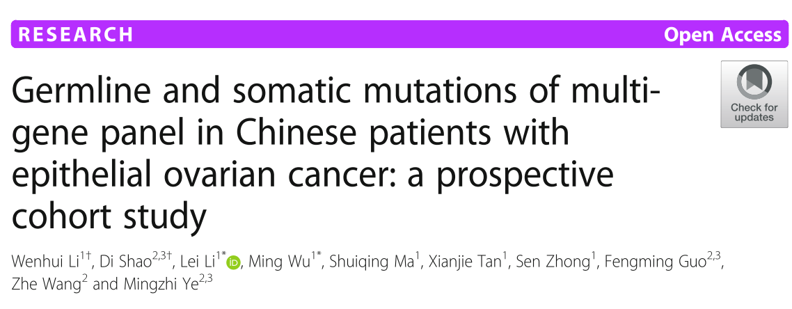
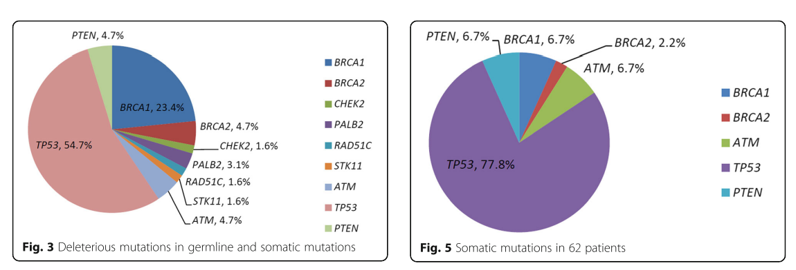

**Background**

Multiple targeted gene sequencing is seldom performed in both germline and somatic testing for ovarian cancer. This study is to evaluate the specific genetic alterations, including both somatic and germline mutations, in Chinese patients with epithelial ovarian cancer (EOC) in a prospective cohort study. 

**Materials and methods**

Mutations in a customed 21-gene panel that included BRCA1 , BRCA2 , and 19 other tumor suppressor genes related to homologous recombination (HR) deficiency or non-HR deficiency were detected by targeted exon capture and next-generation sequencing (NGS) technology across all coding exons and exon-intron (±20 base pairs) boundaries. Patients were enrolled consecutively and unselectively without age or family history consideration. Sixty-two unselected patients with epithelial ovarian cancer were enrolled in our study to be tested for paired somatic and germline mutations. All patients were tested using a 21-gene panel that included BRCA1 , BRCA2 , CHEK2 , PALB2 , BRIP1 , TP53 , PTEN , STK11 , CDH1 , ATM , BARD1 , MLH1 , MRE11A , MSH2 , MSH6 , MUTYH , NBN , PMS1 , PMS2 , RAD50 , and RAD51C . 

**Results**

Mutation analysis revealed that 77.4% (48/62) of patients carried one or more of 64 identified genetic alterations, including 19 germline and 45 somatic deleterious mutations. Twelve individuals shared both germline and somatic mutations. BRCA mutants existed in 17 of 62 (27.4%) patients. Of the 64 mutations detected, 46 (74.2%) were in 7 other HR or non-HR genes, including TP53 , PTEN , ATM , CHEK2 , PALB2 , RAD51C , and STK11 . In somatic mutation analysis, TP53 showed frequent pathogenic or likely pathogenic mutations in 56.5% (35/62) of enrolled cases, among which six cases harbored a loss of heterozygosity. 

**Conclusions**

This is the first report of multi-gene panel testing for germline and somatic mutations among Chinese EOC patients, which revealed a broader deleterious variants than only BRCA testing.

